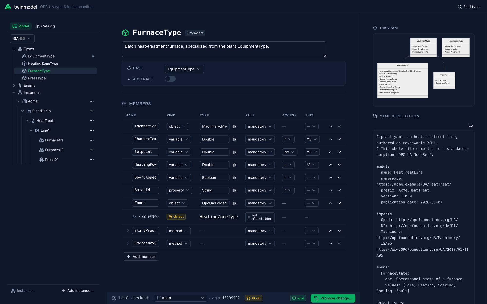

# twinmodel

[](https://github.com/mathieu-sabatier/twin-model/actions/workflows/model.yml)
[](LICENSE)

[](https://modelcontextprotocol.io)

**Author OPC UA information models as small, reviewable YAML — then transpile,
lint, diagram, and open a pull request, from a CLI or a git-backed web editor.**



twinmodel turns a compact YAML DSL into **ModelDesign.xml**, the input format of
the official OPC Foundation
[UA-ModelCompiler](https://github.com/OPCFoundation/UA-ModelCompiler), which
produces the compliant NodeSet2.xml + NodeId CSV. It also exports **CESMII i3X
1.0** JSON, ships an embedded catalog of the published OPC UA companion specs
(DI, Machinery, ISA-95), and serves a single-binary web UI for editing models
against a Git repo and proposing changes as GitHub pull requests.

> twinmodel deliberately does **not** emit NodeSet2.xml itself — Part 5
> compliance (NodeId assignment, inheritance expansion, encodings) is the
> ModelCompiler's job. twinmodel owns the ergonomic authoring layer above it.

### What you get

- **A readable DSL** — object types, instances, enums, methods, units, placeholders — instead of hand-written ModelDesign XML.
- **Semantic linting** — stable `file:line` codes with CI-friendly exit codes.
- **Companion-spec catalog** — DI, Machinery, and ISA-95 resolved automatically on import; browse it from the CLI or UI.
- **ModelCompiler orchestration** — one command transpiles, materializes companion dependencies, and runs the compiler (native .NET or Docker) to NodeSet2.
- **CESMII i3X export** — the same model as i3X 1.0 JSON, offline and golden-tested.
- **A git-backed web editor** — live diagnostics, Mermaid diagrams, semantic diffs, and one-click PR proposals.
- **A single static binary** — the web UI is embedded; `serve` hosts both `/` and `/api`.

## Contents

- [Install](#install)
- [Quickstart](#quickstart)
- [Web UI](#web-ui)
- [Compile to NodeSet2](#compile-to-nodeset2-with-the-official-modelcompiler)
- [Export to CESMII i3X](#export-to-cesmii-i3x)
- [Companion-spec catalog](#companion-spec-catalog-and-imports)
- [DSL reference](#dsl-reference)
- [HTTP API](#http-api)
- [MCP server](#mcp-server)
- [Architecture](#architecture)
- [License](#license)

## Commands

```
twinmodel build  -i model/ -o out/   # transpile *.yaml -> *.ModelDesign.xml
twinmodel export -i model/ -o out/   # transpile *.yaml -> CESMII i3X 1.0 JSON
twinmodel lint   -i model/           # semantic checks only (CI exit codes)
twinmodel schema                     # print the DSL JSON Schema to stdout
twinmodel fmt    -i model/ -w        # canonically format *.yaml in place
twinmodel serve                      # serve the HTTP API (see below)
twinmodel mcp                        # serve the MCP tools over stdio (env: GIT_REPO, GIT_TOKEN, …)
twinmodel catalog list|types|show|search  # browse bundled companion specs (DI, Machinery, ISA-95)
twinmodel compile -i model/ -o out/  # transpile + run the ModelCompiler -> NodeSet2 (needs .NET)
```

`twinmodel fmt` rewrites YAML into canonical form (source key order, two-space
indent, defaults omitted). It emits from the parsed model, so **comments and
custom spacing are dropped** on first format — the web UI writes this same
canonical form.

## Install

```bash
# Go toolchain — installs the `twinmodel` binary into $GOBIN
go install github.com/mathieu-sabatier/twin-model/cmd/twinmodel@latest

# or run the container (multi-arch image, published to GHCR on each release)
docker run --rm -p 8080:8080 -e GIT_REPO=<repo-url> ghcr.io/mathieu-sabatier/twin-model:latest

# or build from source
git clone https://github.com/mathieu-sabatier/twin-model
cd twin-model && go build -o twinmodel ./cmd/twinmodel   # or: task build
```

The `compile` subcommand additionally needs the OPC Foundation ModelCompiler
(.NET tool or Docker image) — see
[Compile to NodeSet2](#compile-to-nodeset2-with-the-official-modelcompiler).

## Quickstart

```bash
# build the CLI
go build -o twinmodel ./cmd/twinmodel        # or: task build

# transpile + lint the bundled example
./twinmodel lint  -i examples/
./twinmodel build -i examples/ -o out/     # -> out/Equipment.ModelDesign.xml

# editor autocomplete: emit the JSON Schema
./twinmodel schema > twinmodel.schema.json
```

With [go-task](https://taskfile.dev): `task check` (vet + test), `task build-model`,
`task compile` (run the ModelCompiler). `task --list` shows everything.

## Web UI

`twinmodel serve` hosts a single-page web editor — the SPA is embedded in the
binary, so there's nothing else to deploy — backed entirely by a **Git
repository** (no database). Point it at a repo and open the browser:

```bash
GIT_REPO=https://github.com/you/your-model.git GIT_TOKEN=<pat> twinmodel serve
# open http://localhost:8080
```

- **Browse & edit** any model file on a branch, with live diagnostics as you type.
- **Catalog palette** — pull in companion-spec types (DI, Machinery, ISA-95) resolved from the embedded catalog.
- **Diagrams** — Mermaid views of the type hierarchy and instance topology.
- **Semantic diff** — a reviewable changelist of what your edit *means*, not a text diff.
- **Propose** — commit the draft to a new branch, push, and open a GitHub pull request in one action.

Drafts live in memory with a TTL; Git stays the single source of truth. The
underlying JSON endpoints are documented under [HTTP API](#http-api).

> **Security:** `serve` is unauthenticated and meant for `localhost` or a
> trusted network behind an authenticating proxy. The push token stays
> server-side and is never sent to the browser. See [SECURITY.md](SECURITY.md)
> before exposing it.

## Compile to NodeSet2 with the official ModelCompiler

There is **no public prebuilt container** for the ModelCompiler; the canonical
distribution is a cross-platform .NET global tool.

```bash
# install once (needs .NET 8 or 10 runtime)
dotnet tool install --global OPCFoundation.Opc.Ua.ModelCompiler.Tool

# first time only — generate the NodeId CSV, then COMMIT it
Opc.Ua.ModelCompiler compile \
  -d2 out/Equipment.ModelDesign.xml \
  -cg examples/Equipment.ModelDesign.csv \
  -o2 out/ -version v105
#   ^ task bootstrap-ids

# every build after that — the CSV is the committed source of truth
Opc.Ua.ModelCompiler compile \
  -d2 out/Equipment.ModelDesign.xml \
  -c  examples/Equipment.ModelDesign.csv \
  -o2 out/ -version v105
#   ^ task compile
```

To run it as a container instead, build the image from the ModelCompiler repo
(it ships a `Dockerfile`; there is no published tag) — wrapped up as `task
compile-docker`, which builds the image on first use and compiles the model:

```bash
task compile-docker        # -> out/Acme.Equipment.NodeSet2.xml (+ NodeId CSV, type schemas)
```

Equivalent by hand:

```bash
git clone https://github.com/OPCFoundation/UA-ModelCompiler /tmp/UA-ModelCompiler
docker build -t ua-modelcompiler:local /tmp/UA-ModelCompiler
docker run --rm --user "$(id -u):$(id -g)" -e HOME=/tmp -v "$PWD:/work" -w /work \
  ua-modelcompiler:local \
  compile -d2 out/Equipment.ModelDesign.xml -c examples/Equipment.ModelDesign.csv -o2 out/ -version v105
```

This path is verified: the bundled example compiles with **zero errors** to a
well-formed `NodeSet2.xml`, and the NodeId CSV is stable across recompiles.

**NodeIds are a reviewed artifact.** The `*.ModelDesign.csv` maps SymbolicIds →
NodeIds and must stay stable across builds. `task bootstrap-ids` creates it once;
CI fails if a compile changes it, so any NodeId churn requires a deliberate commit.

## Export to CESMII i3X

[i3X](https://github.com/cesmii/i3X) (CESMII's Information Interoperability
Interface) is a REST API for serving industrial information models — namespaces,
object types, relationship types, and instances. `twinmodel export` transpiles the
same DSL to the **i3X 1.0** JSON documents an i3X server would serve, so a model
authored here can be loaded into any i3X platform:

```bash
twinmodel export --format i3x -i examples/ -o out/i3x/   # or: task export-i3x
```

It writes five deterministic, byte-stable files:

| File | Contents |
|---|---|
| `info.json` | model header (name, version, publicationDate, i3xVersion) |
| `namespaces.json` | the model namespace + each import (OPC UA core, …) |
| `objecttypes.json` | each `object_type` as a JSON Schema; own members only, `sourceTypeId` links the base |
| `relationshiptypes.json` | the OPC UA reference types used (`HasComponent`, `Organizes`) |
| `objects.json` | declared instances + their composed sub-objects (topology) |

This is a **build-time** complement to CESMII's runtime `OPCUA-i3X` bridge: a pure
`AST → JSON` function, offline and golden-tested. It emits what the model
*describes* (structure); live values, subscriptions, and history — what a running
server *observes* — are deliberately out of scope.

The bundle is **self-contained**: the standard OPC UA (ns0) nodes it references —
`BaseObjectType`, `FolderType`, `ObjectsFolder` — are emitted as minimal
reference stubs (marked `schema.x-opcua.stub`), so every `elementId` resolves
within the bundle and it loads with no external namespace catalog.

Every node's `elementId` is `nsu=<namespaceUri>;s=<SymbolicId>`, where the
SymbolicId is reconstructed from the AST alone (no CSV input). Those SymbolicIds
are exactly the keys of the ModelCompiler CSV, so an i3X consumer can join back
to the compiled NodeSet by SymbolicId.

## Companion-spec catalog and imports

`twinmodel` ships an embedded catalog of the published OPC UA companion specifications
(DI, Machinery, ISA-95). The catalog is used automatically by `lint`, `build`, and
`compile` whenever a model imports a companion namespace.

### imports — short form vs expanded form

```yaml
# Short form — alias only; URI is looked up in the catalog
imports:
  OpcUa: http://opcfoundation.org/UA/
  DI: http://opcfoundation.org/UA/DI/
```

`OpcUa` is always required (ns0). Any other alias whose URI matches a bundled spec
is resolved from the catalog; the companion NodeSet2.xml is materialized at compile
time as a `-d2` dependency passed to the ModelCompiler.

### DI example

`examples/di/pump.yaml` demonstrates a concrete object type built on `DI:DeviceType`
(abstract in the DI companion spec) and a matching instance:

```yaml
model:
  name: AcmePump
  namespace: https://acme.example/UA/Pump/
  prefix: Acme.Pump
  version: 1.0.0
  publication_date: 2026-07-04

imports:
  OpcUa: http://opcfoundation.org/UA/
  DI: http://opcfoundation.org/UA/DI/

object_types:
  PumpType:
    doc: A pump, specialized from the DI DeviceType
    base: DI:DeviceType
    members:
      FlowRate: { type: Double }

instances:
  Pump01: { type: PumpType, under: OpcUa:ObjectsFolder }
```

Linting this model (`twinmodel lint -i examples/di/`) resolves `DI:DeviceType` from
the catalog, validates PumpType's base, and confirms Pump01 is concrete. If you
change `Pump01`'s type to `DI:DeviceType` directly, lint emits:
`abstract-instance: instance "Pump01" uses abstract type "DI:DeviceType"`.

### Browsing the catalog

```bash
twinmodel catalog list             # list all bundled companion specs
twinmodel catalog types DI         # list types in the DI spec
twinmodel catalog show DI:DeviceType  # show DeviceType members
twinmodel catalog search Motor     # full-text search across all specs
```

### Compiling to NodeSet2

```bash
# Via the ModelCompiler Docker image (no .NET install needed) — mounts -o at /work:
twinmodel compile -i examples/di -o out/di --docker-image ua-modelcompiler:local

# Or against a native Opc.Ua.ModelCompiler on PATH:
twinmodel compile -i examples/di -o out/di
```

`twinmodel compile` transpiles the model, materializes the required companion NodeSet2
files, and invokes the ModelCompiler with the correct `-d2` dependency chain.

- `--docker-image ` runs the compiler in a container, bind-mounting the output
  dir (`-o`) at `/work` and passing every path relative to it — so the NodeId CSV is
  bootstrapped inside `-o`. Build the image once with `task modelcompiler-image`.
- `--compiler <path>` / default: use a native `Opc.Ua.ModelCompiler` (needs .NET).
- `--print-cmd` previews the invocation (native or docker) without running it.
- `--compiler` and `--docker-image` are mutually exclusive.

Taskfile shortcuts: `task compile` (equipment model), `task compile-di` (DI example,
end-to-end via the Docker image).

## DSL reference

A model file has five top-level keys: `model`, `imports`, `enums`,
`object_types`, `instances`. See [examples/equipment.yaml](examples/equipment.yaml)
for the canonical example of how each construct maps to ModelDesign XML.

### Member conventions (defaults in **bold**)

| Key | Values | Meaning |
|-----|--------|---------|
| `kind` | `property` · **`variable`** · `object` · `method` | Node class. |
| `rule` | **`mandatory`** · `optional` · `optional_placeholder` · `mandatory_placeholder` | ModellingRule. |
| `access` | **`r`** · `rw` | AccessLevel Read / ReadWrite (variables). |
| `type` | `String`, `Double`, … · `Alias:Name` · `LocalType` | Unprefixed built-in → ns0; `Alias:` → import; else this model. |
| `unit` | `"°C"`, `kN`, … | Numeric variable → `AnalogUnitType` + `EngineeringUnits` (EUInformation, UNECE code). |
| `doc` | text | Description. |

Other mechanics:

- **Placeholders** — a child key `Name<Suffix>` becomes SymbolicName `Name` with
  BrowseName `<NameSuffix>`; the `rule` must be a placeholder rule.
  `"Zone<No>"` → `SymbolicName="Zone"`, `BrowseName="<ZoneNo>"`.
- **Methods** — `kind: method` with `in:`/`out:` lists of `{name, type}`.
- **Enums** — an ordered `values` list gets ids `0..n`; pin a specific id with the
  `{ Name: 4 }` form (switches the compiler to EnumValues).
- **Instances** — `name: { type, under }` → a top-level Object with an inverse
  `Organizes` reference from `under` (e.g. `OpcUa:ObjectsFolder`).
- **Instance values & children** — an instance may override value-bearing members
  (`values: { SerialNumber: "F-2026-0042" }`) and instantiate placeholders
  (`children: { Zone1: { of: "Zone<No>" } }`). `under:` may name an import target
  or another instance (nesting).

### Hierarchy & ISA-95 levels

Every instance sits in the canonical ISA-95 hierarchy via its `under` reference
(a root sits `under: OpcUa:ObjectsFolder`; nesting points at another instance).

Organizational nodes declare a `level` — an `ISA95EquipmentElementLevelEnum`
value — and are typed `ISA95:EquipmentType`:

```yaml
hierarchy: { allowLevelSkip: true }    # false (the default) would reject Line1 skipping Area below

instances:
  Acme:        { type: ISA95:EquipmentType, level: Enterprise, under: OpcUa:ObjectsFolder }
  PlantBerlin: { type: ISA95:EquipmentType, level: Site,       under: Acme }
  Line1:       { type: ISA95:EquipmentType, level: WorkCenter, under: PlantBerlin }  # skips Area
  Filler1:     { type: FillerType,          under: Line1 }                           # equipment leaf
```

Level ordering (strict by default): Enterprise > Site > Area > WorkCenter > WorkUnit.
Equipment (types without an `EquipmentLevel` member) may only be parented under a
WorkCenter- or WorkUnit-tier node, and never under another equipment instance.

| Tier | Accepted `level` values |
|---|---|
| Enterprise | `Enterprise` |
| Site | `Site` |
| Area | `Area` |
| WorkCenter | `WorkCenter`, `ProductionLine`, `ProcessCell`, `StorageZone` |
| WorkUnit | `WorkUnit`, `Unit`, `WorkCell`, `ProductionUnit`, `StorageUnit` |

`EquipmentModule`, `ControlModule`, and `Other` are valid levels but tier-less (leaf equipment).

**OPC UA idiom notes.** The hierarchy exports as `Organizes` references (pragmatic
profile) rather than ISA-95 `MadeUpOfEquipment`; `level` exports as the standard
`EquipmentLevel` property on any node whose type has that member. Machinery/DI
equipment leaves intentionally omit `EquipmentLevel`.

### Lint rules

`twinmodel lint` reports stable codes with `file:line`, exit 1 on any error
(defined as `dsl.Code*` constants — the single source of truth):
`unknown-type`, `unknown-import-alias`, `unknown-base`, `duplicate-type`,
`duplicate-member`, `inheritance-cycle`, `placeholder-without-rule`,
`rule-without-placeholder`, `unknown-unit`, `unit-on-non-numeric`,
`unit-on-property`, `unit-requires-variable`, `abstract-instance`,
`empty-enum`, `duplicate-enum-value`, `duplicate-enum-id`, `negative-enum-id`,
`namespace-trailing-slash`, `version-semver`,
`invalid-kind` / `invalid-rule` / `invalid-access`,
`unknown-value-member`, `value-not-value-bearing`, `unknown-placeholder`,
`unknown-under`, `instance-cycle`,
`unknown-import-type`, `import-not-bundled`,
`unknown-level`, `level-on-unsupported-type`, `hierarchy-level-order`,
`hierarchy-level-skip`, `equipment-parent`, `machine-under-machine`.

## HTTP API

`twinmodel serve` runs a single-binary JSON API (stdlib net/http, no framework).
Git is the only persistence; drafts live in memory with a TTL.

Environment:

    GIT_REPO    required   HTTPS repo URL, e.g. https://github.com/org/model.git
    GIT_TOKEN   required*  token with push + PR scope (never sent to the browser)
    DRAFT_TTL   optional   draft idle lifetime (default 2h)
    ADDR        optional   listen address (default :8080)
    GITHUB_API  optional   REST base override (default https://api.github.com)

Endpoints:

    GET  /api/model?ref=&file=                       AST-as-JSON + diagnostics (committed ref)
    POST /api/drafts {baseRef}                        create draft -> {id}
    GET  /api/drafts/{id}/model?file=                 draft AST-as-JSON + diagnostics
    PUT  /api/drafts/{id}/files {files}               update YAML (server canonicalizes)
    POST /api/drafts/{id}/validate?file=              diagnostics (with Path)
    GET  /api/drafts/{id}/preview/modeldesign?file=   ModelDesign XML
    GET  /api/drafts/{id}/preview/diagram?file=&view= Mermaid (view=types|instances)
    GET  /api/drafts/{id}/diff?file=                  semantic changelist vs baseRef
    GET  /api/drafts/{id}/types/{name}/resolved?file= flattened inherited members
    POST /api/drafts/{id}/propose {branch,title,message}  commit+push+open PR -> {url}
    GET  /api/schema                                  the DSL JSON Schema
    GET  /api/repo                                    repo context: owner/repo, commit identity, proposeEnabled+reason
    GET  /api/prs                                     open pull requests (also seeds the editor's branch picker)
    GET  /api/catalog                                 bundled companion specs (alias, version, deps)
    GET  /api/catalog/{alias}/types                   ObjectTypes/VariableTypes in a spec
    GET  /api/catalog/{alias}/types/{name}            base chain + resolved members
    GET  /api/catalog/search?q=<kw>                   matching companion types across all specs

A draft with any parse error or error-severity diagnostic cannot be proposed
(`409`). `* GIT_TOKEN` is required to propose; reads work without it on public repos.

`ref`/`baseRef` must be a **branch** name (the editor works off a branch, and a
GitHub PR base must be a branch); tags and raw commit SHAs are not resolved.

## MCP server

`twinmodel mcp` exposes the modeling operations as Model Context Protocol tools,
so an AI assistant can read parsed models, browse the bundled companion-spec
catalog, validate/preview drafts, and open pull requests — the same reach as the
web editor. It shares `serve`'s configuration (`GIT_REPO`, `GIT_TOKEN`, …).

Tools: `get_model`, `list_model_files`, `parse_model`, `preview_modeldesign`,
`preview_diagram`, `resolve_type`, `list_namespaces`, `list_types`,
`get_type_details`, `search_types`, `find_unit`, `get_schema`, `repo_info`,
`list_prs`, `list_branches`, `create_draft`, `update_draft`, `draft_diff`,
`propose_pr`.

**stdio (desktop clients).** The client spawns `twinmodel mcp` as a subprocess
and passes the repo config in its environment. With Claude Code:

    claude mcp add twinmodel -e GIT_REPO=https://github.com/org/model.git -e GIT_TOKEN=ghp_… -- twinmodel mcp

(`twinmodel` must be on `PATH`; `GIT_TOKEN` is only needed to open PRs.) The
equivalent client-config JSON:

    {
      "mcpServers": {
        "twinmodel": {
          "command": "twinmodel",
          "args": ["mcp"],
          "env": { "GIT_REPO": "https://github.com/org/model.git", "GIT_TOKEN": "…" }
        }
      }
    }

**Hosted (HTTP).** `twinmodel serve` also mounts the MCP streamable-HTTP
transport at `/mcp` (default `http://localhost:8080/mcp`; set `ADDR` to change
the port), sharing the editor's in-process draft store — a draft an AI creates
over `/mcp` is openable in the browser, and vice-versa. The running server
already holds the `GIT_REPO`/`GIT_TOKEN` config, so a client just points at the
URL — no env needed. With Claude Code:

    claude mcp add --transport http twinmodel http://localhost:8080/mcp

The equivalent client-config JSON:

    {
      "mcpServers": {
        "twinmodel": {
          "type": "http",
          "url": "http://localhost:8080/mcp"
        }
      }
    }

## Architecture

```
cmd/twinmodel/        CLI: build | lint | fmt | schema | export | serve | catalog | compile
internal/dsl/         YAML -> typed AST (parse) + semantic lint (validate). XML-free.
internal/modeldesign/ AST -> ModelDesign XML (deterministic, golden-tested).
internal/i3x/         AST -> CESMII i3X 1.0 JSON (deterministic, golden-tested).
internal/nodeset/     NodeSet2 companion-spec parser + catalog (DI, Machinery, ISA-95).
internal/mermaid/     AST -> Mermaid diagrams (type hierarchy + instance topology).
internal/semdiff/     semantic diff between two model revisions.
internal/api/         `serve` HTTP JSON API: Git-backed drafts + GitHub PR proposals.
internal/web/         embedded single-page web UI (served at /).
schema/               hand-written DSL JSON Schema, embedded for `twinmodel schema`.
ui/                   web UI source (Nuxt/Vue); built and embedded into internal/web.
examples/             equipment.yaml (ns0-only) + examples/di/pump.yaml (DI companion spec).
```

The `internal/dsl` AST is the stable seam a future HTTP API / UI / i3X export can
reuse — it carries modelling semantics and source positions, and knows nothing
about XML. Output is deterministic (source order preserved, no timestamps beyond
the model publication date) so it golden-tests and reviews cleanly.

Requirements: Go ≥ 1.26 (see `go.mod`). The core transpiler (`dsl`,
`modeldesign`, `i3x`) is stdlib + `gopkg.in/yaml.v3` only; `serve` adds `go-git`
for repository access, and `compile` shells out to the OPC Foundation
ModelCompiler.

## License

Released under the [MIT License](LICENSE).

The bundled OPC Foundation companion specifications
([`internal/nodeset/specs/`](internal/nodeset/specs/)) are redistributed under
the OPC Foundation MIT License 1.00. See [THIRD_PARTY_LICENSES.md](THIRD_PARTY_LICENSES.md)
for attribution of all bundled specs and dependencies.
